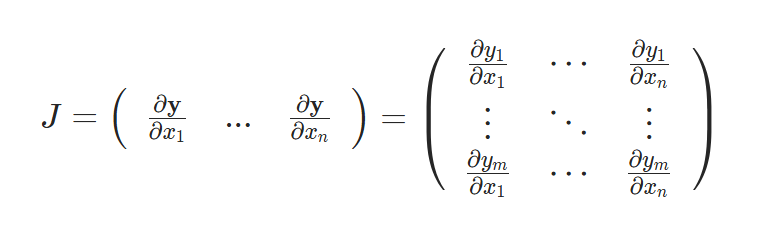
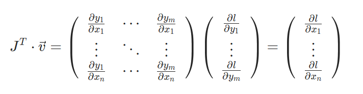

# Basics of PyTorch & Tensor

## Tensors

Tensors are very similar to arrays and matrices used in numpy. But with PyTorch, these arrays can be run using GPU and hardware accelerators.

In Pytorch, Tensors can be created with 4 different ways.<br>
The first way is by using ```tensor``` function in the torch library.
```Python
data = [[1, 2],[3, 4]]
x_data = torch.tensor(data)
```
<br>
The second is by creating a numpy array, then convert it to a tensor. <br><br>

```Python
data = np.arange(4).reshape((2,2))
x_data = torch.from_numpy(data)
```
<br>
The third, is by using another Tensor, and this will keep all the properties(shape, datatype...), unless explicitly overriden.

```Python
x_ones = torch.ones_like(x_data)
print(f"Ones Tensor: \n {x_ones} \n")

x_rand = torch.rand_like(x_data, dtype=torch.float)
print(f"Random Tensor: \n {x_rand} \n")

x_same = torch.full_like(x_data, 3)
print(f"Same Tensor: \n {x_same} \n")
```
<b>Output:</b>

```Python
Ones Tensor: 
 tensor([[1, 1],
        [1, 1]]) 

Random Tensor: 
 tensor([[0.0841, 0.8118],
        [0.7337, 0.4393]]) 

Same Tensor: 
 tensor([[3, 3],
        [3, 3]])
```
<b>⚠ </b>There are others ```torch.like``` functions, i'll let you discover them by yourself.

And the 4th one, is by using random or constant values. In that cases we want to create a shape tuples that we will use as a parameters to create tensors.

```Python
shape = (2,3,)
rand_tensor = torch.rand(shape)
ones_tensor = torch.ones(shape)
zeros_tensor = torch.zeros(shape) 
# Or
rand_wo_shape_tensor = torch.rand(2,3,4)

print(f"Random Tensor: \n {rand_tensor} \n")
print(f"Ones Tensor: \n {ones_tensor} \n")
print(f"Zeros Tensor: \n {zeros_tensor} \n")
print(f"Random w/o using variable :  \n {rand_wo_shape_tensor}")
```
<b>Output:</b>
```Python
Random Tensor: 
 tensor([[0.7407, 0.1732, 0.0646],
        [0.4318, 0.2261, 0.1133]]) 

Ones Tensor: 
 tensor([[1., 1., 1.],
        [1., 1., 1.]]) 

Zeros Tensor: 
 tensor([[0., 0., 0.],
        [0., 0., 0.]]) 

Random w/o using variable :  
 tensor([[[0.5018, 0.6175, 0.6010, 0.3538],
         [0.5530, 0.8819, 0.6459, 0.4914],
         [0.6371, 0.8648, 0.6505, 0.6429]],

        [[0.5313, 0.6890, 0.3366, 0.4686],
         [0.7268, 0.8813, 0.7029, 0.3139],
         [0.2227, 0.3369, 0.9187, 0.4213]]])
```

### Attributes of a Tensor

Tensor attributes describe their shape, datatype, and the device on which they are stored.

```Python
tensor = torch.rand(3,4)

print(f"Shape of tensor: {tensor.shape}")
print(f"Datatype of tensor: {tensor.dtype}")
print(f"Device tensor is stored on: {tensor.device}")
```

<b>Output:</b>

```Python
Shape of tensor: torch.Size([3, 4])
Datatype of tensor: torch.float32
Device tensor is stored on: cpu
```

### Operations on Tensors

There is more than 100 operations than can be done on tensor. It goes from arithmetic to matrix manipulation and even more... ([see here](https://docs.pytorch.org/docs/stable/torch.html)).

They can all be done on the GPU. Colab, allocate a GPU by going to Runtime > Change runtime type > GPU.

By default, tensor are created on the CPU. By moving them into the GPU, we have to explicitly move them with the ```.to``` method (after checking for GPU availability). Keep in mind that copying large tensors across devices can be expensive in terms of time and memory!

```Python
# We move our tensor to the current accelerator if available
if torch.accelerator.is_available():
    tensor = tensor.to('cuda')
```

```Python
tensor = torch.ones(4, 4)
print('First row: ',tensor[0])
print('First column: ', tensor[:, 0])
print('Last column:', tensor[..., -1])
tensor[:,1] = 0
print(tensor)
```
<b>Output:</b>
```
First row:  tensor([1., 1., 1., 1.])
First column:  tensor([1., 1., 1., 1.])
Last column: tensor([1., 1., 1., 1.])
tensor([[1., 0., 1., 1.],
        [1., 0., 1., 1.],
        [1., 0., 1., 1.],
        [1., 0., 1., 1.]])
```
<br>
To concatenate, you can use ```torch.cat``` to concatenate a list of tensors along a given dimension.

```Python
t1 = torch.cat([tensor, tensor, tensor], dim=1)
print(t1)
```

<b>Output:</b>

```Python
tensor([[1., 0., 1., 1., 1., 0., 1., 1., 1., 0., 1., 1.],
        [1., 0., 1., 1., 1., 0., 1., 1., 1., 0., 1., 1.],
        [1., 0., 1., 1., 1., 0., 1., 1., 1., 0., 1., 1.],
        [1., 0., 1., 1., 1., 0., 1., 1., 1., 0., 1., 1.]])
```

#### Arithmetic operations

To compute the matrix multiplaction, there are 3 differents way:

```Python
y1 = tensor @ tensor.T
y2 = tensor.matmul(tensor.T)

y3 = torch.rand_like(tensor)
torch.matmul(tensor, tensor.T, out=y3)
```

Same for element wise operations:

```Python
z1 = tensor * tensor
z2 = tensor.mul(tensor)

z3 = torch.rand_like(tensor)
torch.mul(tensor, tensor, out=z3)
```

Single-element tensors If you have a one-element tensor, for example by aggregating all values of a tensor into one value, you can convert it to a Python numerical value using ```item()```: 

```Python
agg = tensor.sum()
agg_item = agg.item()
print(agg_item, type(agg_item))
```
<b>Output : </b>
```Python
12.0 <class 'float'>
```

#### In place operations

In-place operations Operations that store the result into the operand are called in-place. They are denoted by a ```_``` suffix. For example: ```x.copy_(y)```, ```x.t_()```, will change ```x```.


```Python
print(tensor, "\n")
tensor.add_(5)
print(tensor)
```

<b>Output : </b>
```Python
tensor([[1., 0., 1., 1.],
        [1., 0., 1., 1.],
        [1., 0., 1., 1.],
        [1., 0., 1., 1.]]) 

tensor([[6., 5., 6., 6.],
        [6., 5., 6., 6.],
        [6., 5., 6., 6.],
        [6., 5., 6., 6.]])
```

### Bridge with NumPy

Tensors on the CPU and NumPy arrays can share their underlying memory locations, and changing one will change the other.

#### Tensor to NumPy array

```Python
t = torch.ones(5)
print(f"t: {t}")
n = t.numpy()
print(f"n: {n}")
```

<b>Output</b>

```Python
t: tensor([1., 1., 1., 1., 1.])
n: [1. 1. 1. 1. 1.]
```
A change in the tensor reflects in the NumPy array.


```Python
t.add_(1)
print(f"t: {t}")
print(f"n: {n}")
```
<b>Output</b>
```Python
t: tensor([2., 2., 2., 2., 2.])
n: [2. 2. 2. 2. 2.]
```

#### NumPy array to Tensor

```Python
n = np.ones(5)
t = torch.from_numpy(n)
```
Changes in the NumPy array reflects in the tensor.
```Python
np.add(n, 1, out=n)
print(f"t: {t}")
print(f"n: {n}")
```
<b>Output</b>
```Python
t: tensor([2., 2., 2., 2., 2.], dtype=torch.float64)
n: [2. 2. 2. 2. 2.]
```

## A Gentle Introduction to torch.autograd

### What is autograd?

```torch.autograd``` is PyTorch’s automatic differentiation engine. It powers the gradient computation used during neural network training.

Neural networks are composed of functions defined by parameters (weights, biases). During training, PyTorch performs the following steps:

1. Forward Propagation: The model makes a prediction using input data.

2. Loss Calculation: The prediction is compared to the true label to compute an error.

3. Backward Propagation: PyTorch computes the derivatives (gradients) of the loss with respect to each parameter.

4. Gradient Descent: An optimizer updates the parameters based on these gradients.

### Example of One Training Step

```Python
import torch
from torchvision.models import resnet18, ResNet18_Weights

# 1. Load a pretrained model
model = resnet18(weights=ResNet18_Weights.DEFAULT)

# 2. Create dummy input data and simulated labels
data = torch.rand(1, 3, 64, 64)       # Batch of 1 image (3 channels, 64x64)
labels = torch.rand(1, 1000)          # Dummy label vector for 1000 classes

# 3. Forward pass: compute predictions
prediction = model(data)

# 4. Compute the loss (here a simple sum for demonstration)
loss = (prediction - labels).sum()

# 5. Backward pass: compute gradients
loss.backward()

# 6. Define an optimizer (Stochastic Gradient Descent with momentum)
optim = torch.optim.SGD(model.parameters(), lr=1e-2, momentum=0.9)

# 7. Update model parameters
optim.step()
```

### Technical Notes

```.backward()``` triggers autograd to compute the gradients for all model parameters.

These gradients are stored in the ```.grad``` attribute of each parameter.

The ```.step()``` method applies the gradient descent update using those gradients.

## Differentiation in Autograd

Let's make a red line as an exemple.
We create 2 tensors with ```requires_grad=True```, it signals to autograd that every operation on then should be track.

```Python
import torch

a = torch.tensor([2., 3.], requires_grad=True)
b = torch.tensor([6., 4.], requires_grad=True)
```

And now another one named ```Q``` from ```a``` and ```b```


<br>

```Python
Q = 3*a**3 - b**2
```

Let’s assume a and b to be parameters of an NN, and Q to be the error. In NN training, we want gradients of the error w.r.t. parameters, i.e.

<br>


When we call .backward() on Q, autograd calculates these gradients and stores them in the respective tensors’ .grad attribute.

We need to explicitly pass a gradient argument in Q.backward() because it is a vector. gradient is a tensor of the same shape as Q, and it represents the gradient of Q w.r.t. itself, i.e.


Equivalently, we can also aggregate Q into a scalar and call backward implicitly, like Q.sum().backward().

```Python
external_grad = torch.tensor([1., 1.])
Q.backward(gradient=external_grad)
```

Gradients are now deposited in a.grad and b.grad

```Python
# check if collected gradients are correct
print(9*a**2 == a.grad)
print(-2*b == b.grad)
```

<b>Output: </b>

```Python
tensor([True, True])
tensor([True, True])
```

### Vector Calculus using autograd

Mathematically, if you have a vector valued function , then the gradiant  with the respect to  is a Jacobian matrix :


Generally speaking, ```torch.autograd```  is an engine for computing vector-Jacobian product. That is, given any vector , compute the product .<br><br>

If  happens to be the gradient of a scalar function 


then by the chain rule, the vector-Jacobian product would be the gradient of   with respect to 



This characteristic of vector-Jacobian product is what we use in the above example; ```external_grad``` represents 

### Optimizers & Gradient Descent

An optimizer (e.g., torch.optim.SGD, Adam) performs gradient descent using the gradients stored in .grad:
1. It updates parameters with a rule like:
`param = param - learning_rate * param.grad`
2. Then you call `.zero_grad()` to reset gradients before the next step.

This loop happens at each training iteration:

```python
loss.backward()   # compute gradients
optimizer.step()  # apply gradient descent
optimizer.zero_grad()  # reset gradients
```


### Fine-tuning Pretrained Models

When fine-tuning a pretrained model (e.g., ResNet):
- The weights are already trained on a large dataset (e.g., ImageNet).

- You often replace the final classification layer to adapt it to a new task.

- All other layers can either:

    - Stay frozen (`requires_grad=False`)

    - Or be updated (set `requires_grad=True`)

Then, during training:

- Gradients are computed only for parameters with `requires_grad=True`.

- The optimizer updates only these parameters.


## Neural Networks

Let's break down how to build neural networks in PyTorch using the `torch.nn` package.

Building Neural Networks with `torch.nn`
You use `torch.nn` to construct neural networks. It works hand-in-hand with `autograd` (PyTorch's automatic differentiation engine) to define models and compute their gradients. Essentially, an `nn.Module` is like a container for your network's layers, and it includes a `forward(input)` method that spits out the model's output.

Imagine a simple feed-forward network, like one for classifying digits. It just takes an input, pushes it through several layers, and then gives you an output.

Here's the typical game plan for training a neural network:

1. <b>Define the Network:</b> Set up your neural network with its adjustable parameters (weights).

2. <b>Loop Through Data:</b> Go through your dataset, feeding inputs into the network.

3. <b>Process Input:</b> Run the input through the network to get a prediction.

4. <b>Calculate Loss:</b> Figure out how far off your prediction is from the truth.

5. <b>Backpropagate Gradients:</b> Compute the gradients of the loss with respect to the network's parameters.

6. <b>Update Weights:</b> Adjust the network's weights, usually following a simple rule like   `weight = weight - learning_rate * gradient`.

### Defining Your Network

Let's look at an example. Here's a `Net` class that inherits from `nn.Module`:

```Python
import torch
import torch.nn as nn
import torch.nn.functional as F

class Net(nn.Module):
    def __init__(self):
        super(Net, self).__init__()
        # 1 input channel, 6 output channels, 5x5 kernel
        self.conv1 = nn.Conv2d(1, 6, 5)
        self.conv2 = nn.Conv2d(6, 16, 5)
        # Affine operations: y = Wx + b
        self.fc1 = nn.Linear(16 * 5 * 5, 120)
        self.fc2 = nn.Linear(120, 84)
        self.fc3 = nn.Linear(84, 10)

    def forward(self, input):
        # Convolution + ReLU + Max Pooling for C1/S2
        c1 = F.relu(self.conv1(input))
        s2 = F.max_pool2d(c1, (2, 2))

        # Convolution + ReLU + Max Pooling for C3/S4
        c3 = F.relu(self.conv2(s2))
        s4 = F.max_pool2d(c3, 2)

        # Flatten the tensor before fully connected layers
        s4 = torch.flatten(s4, 1)

        # Fully connected layers with ReLU
        f5 = F.relu(self.fc1(s4))
        f6 = F.relu(self.fc2(f5))

        # Output layer
        output = self.fc3(f6)
        return output

net = Net()
print(net)
```

<b>Output : </b>

```Python
Net(
  (conv1): Conv2d(1, 6, kernel_size=(5, 5), stride=(1, 1))
  (conv2): Conv2d(6, 16, kernel_size=(5, 5), stride=(1, 1))
  (fc1): Linear(in_features=400, out_features=120, bias=True)
  (fc2): Linear(in_features=120, out_features=84, bias=True)
  (fc3): Linear(in_features=84, out_features=10, bias=True)
)
```

The cool part? You only need to define the `forward` function. PyTorch's autograd automatically handles the `backward` function for gradient computation. You can use any Tensor operation within your forward pass.

You can grab all the learnable parameters of your model using `net.parameters()`:

```Python
params = list(net.parameters())
print(len(params))
print(params[0].size()) # This shows the size of conv1's weights
```
<b>Output : </b>

```Python
10
torch.Size([6, 1, 5, 5])
```
Let's test it with a random 32x32 input (LeNet, the network used here, expects 32x32 images). If you're using MNIST, remember to resize your images!

```Python
input = torch.randn(1, 1, 32, 32)
out = net(input)
print(out)
```
<b>Output : </b>

```Python
tensor([[-0.1633,  0.1241, -0.0897,  0.1247, -0.0872, -0.1205, -0.0158, -0.0746,
          0.0892, -0.0312]], grad_fn=<AddmmBackward0>)
```

To clear out any old gradients and then compute new ones (with some random values for demonstration):

```Python
net.zero_grad() # Clears gradients for all parameters
out.backward(torch.randn(1, 10)) # Computes new gradients
```

<b>A quick heads-up: </b> `torch.nn` is built for mini-batches. This means layers like `nn.Conv2d` expect a 4D Tensor: `nSamples x nChannels x Height x Width`. If you only have a single image, just use `input.unsqueeze(0)` to add that "fake" batch dimension.

#### Recap of Key Components so far

Here's a quick refresher on the core PyTorch classes you've just seen:

* <b>torch.Tensor:</b> Your go-to for multi-dimensional arrays that support `autograd` operations like `backward()`. They also hold the calculated gradients.

* <b>nn.Module:</b> The foundational class for building neural network modules. It neatly packages your parameters and offers helpers for things like moving them to a GPU.

* <b>nn.Parameter:</b> A special kind of `Tensor` that automatically registers itself as a parameter when you assign it as an attribute to an `nn.Module`.

* <b>autograd.Function:</b> This is where the magic happens behind the scenes. It defines how a PyTorch operation's forward and backward passes work. Every `Tensor` operation creates at least one `Function` node that tracks its history.

##### At this point, we covered:

* Defining a neural network

* Processing inputs and calling backward

##### Still Left:

* Computing the loss

* Updating the weights of the network

### Loss Function

A loss function takes the (output, target) pair of inputs, and computes a value that estimates how far away the output is from the target.

There are several different loss functions under the `nn` package . A simple loss is: `nn.MSELoss` which computes the mean-squared error between the output and the target.

Exemple :

```Python
output = net(input)
target = torch.randn(10)  # a dummy target, for example
target = target.view(1, -1)  # make it the same shape as output
criterion = nn.MSELoss()

loss = criterion(output, target)
print(loss)
```
<b>Output : </b>

```Python
tensor(1.3472, grad_fn=<MseLossBackward0>)
```

Now, if you follow `loss` in the backward direction, using its `.grad_fn` attribute, you will see a graph of computations that looks like this:

```Text
input -> conv2d -> relu -> maxpool2d -> conv2d -> relu -> maxpool2d
      -> flatten -> linear -> relu -> linear -> relu -> linear
      -> MSELoss
      -> loss
```

So, when we call `loss.backward()`, the whole graph is differentiated w.r.t. the neural net parameters, and all Tensors in the graph that have `requires_grad=True` will have their `.grad` Tensor accumulated with the gradient.

### Backprop

So, you've computed your prediction and your loss. Now, to make the magic happen and tell your network how to adjust its parameters, you simply call `loss.backward()`.

<b>Crucial point:</b> Before you call `loss.backward()` for a new batch, you must clear out any old gradients. If you don't, PyTorch will accumulate the new gradients with the existing ones, leading to incorrect updates.

Let's see this in action with `conv1`'s bias gradients:

```Python
net.zero_grad() # This wipes out any previously computed gradients

print('conv1.bias.grad before backward')
print(net.conv1.bias.grad) # It's 'None' because it's just been zeroed or hasn't been computed yet

loss.backward() # Now, the gradients are calculated and stored

print('conv1.bias.grad after backward')
print(net.conv1.bias.grad) # Voila! Gradients appear here
```

<b>Output : </b>

```Python
conv1.bias.grad before backward
None
conv1.bias.grad after backward
tensor([ 0.0058,  0.0074, -0.0054,  0.0074,  0.0059,  0.0128])
```

As you can see, before `loss.backward()`, the gradient for `conv1.bias` is `None` (or zeroed if it had been computed before). After `loss.backward()`, it's populated with the actual gradient values.

The `nn` package contains various modules and loss functions, see it [here](https://docs.pytorch.org/docs/stable/nn.html)

##### What's Next?

The final piece of the puzzle is: <b>Updating the weights of the network</b>. That's where optimizers come in! You'll use them to apply those calculated gradients to actually adjust your model's parameters and make it learn.

### Update the weights

The simplest update rule used in practice is the Stochastic Gradient Descent (SGD):

```Python
weight = weight - learning_rate * gradient
```

We can implement this using simple Python code:

```Python
learning_rate = 0.01
for f in net.parameters():
    f.data.sub_(f.grad.data * learning_rate)
```

However, as you use neural networks, you want to use various different update rules such as SGD, Nesterov-SGD, Adam, RMSProp, etc. To enable this, we built a small package: `torch.optim` that implements all these methods. Using it is very simple:

```Python
import torch.optim as optim

# create your optimizer
optimizer = optim.SGD(net.parameters(), lr=0.01)

# in your training loop:
optimizer.zero_grad()   # zero the gradient buffers
output = net(input)
loss = criterion(output, target)
loss.backward()
optimizer.step()    # Does the update
```

<b>Note</b>
Observe how gradient buffers had to be manually set to zero using `optimizer.zero_grad()`. This is because gradients are accumulated as explained in the [Backprop](##Backprop) section.